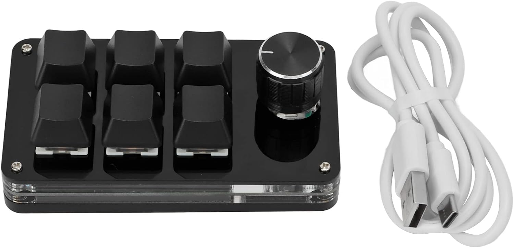

# 💩⌨️ shitty-shortcuts

A tiny macOS menubar app that turns a **cheap 6-button macro keypad** into a
scriptable productivity weapon. Lua-configurable, Hammerspoon-flavored API,
zero dependencies, ~1000 lines of Swift with an embedded Lua 5.4.

Born from the question: *"can my 6-button AliExpress keypad switch kitty tabs,
drive a remote zellij, jump to my web apps, and type whisper-transcribed voice
into my terminal?"* Yes. Yes it can.

## What it does

- **Global hotkeys** via Carbon `RegisterEventHotKey` - **no Accessibility
  permission needed**, with separate press/release events (push-to-talk!)
- **Lua config** (`~/.config/shitty-shortcuts/init.lua`) with a small,
  Hammerspoon-compatible API (`ss.*`, aliased as `hs.*`)
- **Built-in config editor** - dark theme, Lua syntax highlighting,
  ⌘S saves and hot-reloads
- **Profiles** - same buttons, different meanings (desktop vs pi-control),
  switchable from the menubar, persisted, with Lua change hooks
- **HUD alerts** - stacking, Hammerspoon-style on-screen messages
- **Process spawning** with exit-code/stdout callbacks
- **Audio device enumeration** + **menubar mic picker** - choose the voice
  input device from the menu, or define preference rules in Lua
- **JSON decoding** (parse `kitten @ ls` and friends)

## The hardware

Any CH57x-based macro keypad works. I use this 6-button + 1-knob one
(~15 EUR): [6-key + knob macro keypad on Amazon](https://www.amazon.de/dp/B0D73TXFD8?ref=ppx_yo2ov_dt_b_fed_asin_title)



### Program the keypad (one time only!)

The keypad stores its mapping in **onboard flash** - you program it once and
the tool is never needed again (until you want different chords). No drivers,
no background software:

```sh
cargo install ch57x-keyboard-tool
ch57x-keyboard-tool upload < examples/ch57x-keypad.yaml
```

The trick: every button emits a "hyper" chord (`cmd+ctrl+alt+shift+N`) that
no human would ever type, and shitty-shortcuts binds those globally.
Works with any keypad/keyboard that can emit weird chords - the app doesn't
care where they come from.

## Install

Download the latest release, unzip, drop `shitty-shortcuts.app` into
`/Applications`, launch. A 💩⌨️ appears in your menubar.

Or build from source (any macOS 13+, Xcode toolchain):

```sh
git clone https://github.com/hjanuschka/shitty-shortcuts
cd shitty-shortcuts
swift build -c release
./package-app.sh   # produces shitty-shortcuts.app
```

Put your config at `~/.config/shitty-shortcuts/init.lua`
(start from [examples/init.lua](examples/init.lua)), or use
**menubar → Edit Config** and write it in the built-in editor.

## Samples

### Focus-or-create a tab (never duplicate Gmail again)

```lua
ss.hotkey.bind(hyper, "g", function()
  ss.task.new(chrome, nil, {
    "--focus=https://mail.google.com/*",   -- focus existing tab (MRU, any window)
    "https://mail.google.com",             -- ...or open it if missing
  }):start()
end)
```

Full sample: [examples/focus-or-create-tab.lua](examples/focus-or-create-tab.lua)

### Jump to web apps (Chrome 143+)

Uses Chrome's `--focus` flag: focuses the existing tab if one matches,
opens it if not. MRU-picking across all windows.

```lua
local hyper = { "cmd", "alt", "ctrl", "shift" }
local chrome = "/Applications/Google Chrome.app/Contents/MacOS/Google Chrome"

local function webapp(selector, url)
  return function()
    ss.task.new(chrome, nil, { "--focus=" .. selector, url }):start()
  end
end

ss.hotkey.bind(hyper, "g", webapp("https://mail.google.com/*", "https://mail.google.com"))
ss.hotkey.bind(hyper, "h", webapp("https://github.com/*", "https://github.com"))
ss.hotkey.bind(hyper, "y", webapp("https://news.ycombinator.com/*", "https://news.ycombinator.com"))
```

### Push-to-talk voice → terminal

Hold a button, speak, release: records with sox, transcribes locally with
whisper.cpp, types the text into your focused kitty window.

```lua
ss.hotkey.bind(hyper, "4", startRecording, stopAndTranscribe)
```

See [examples/init.lua](examples/init.lua) for the full implementation
(mic auto-selection, animated spinner alert, the works).

### Control kitty like a puppet

```lua
-- focus tab 2
kitten({ "focus-tab", "-m", "index:1" })

-- find the window running some process and jump to it
focusKittyWindowByCmdline("ssh my-dev-box")

-- type into the focused window
kitten({ "send-text", "-m", "state:focused", "--", "make -j8\n" })
```

### Remote zellij/tmux tabs

```lua
ss.hotkey.bind(hyper, "1", function()
  ss.task.new("/usr/bin/ssh", nil, {
    "-o", "BatchMode=yes", "you@dev-box",
    "zellij --session main action go-to-tab 1",
  }):start()
end)
```

### Micro mode: a $17 control surface for the pi coding agent

Flip the keypad's hardware layer switch and the same 6 buttons become a
remote control for [pi](https://pi.dev) running in zellij over ssh:
interrupt, submit, model picker (knob-navigated!), thinking level,
tool output - and hold-to-talk voice dictation straight into pi's editor.

See [examples/pi-micro-mode.lua](examples/pi-micro-mode.lua).

### Context-aware controls

The knob means different things depending on what's in front:
Chrome -> cycle tabs, kitty -> cycle kitty/zellij tabs, elsewhere -> volume.

```lua
local function knobTurn(direction)
  local front = ss.application.frontmost()
  if front == "Google Chrome" then chromeCycleTab(direction)
  elseif front == "kitty" then kittyOrZellijTab(direction)
  else volumeDelta(direction * 6) end
end
```

Full sample: [examples/context-aware-knob.lua](examples/context-aware-knob.lua)

More in [examples/](examples/).

## API reference

Everything lives under the global `ss` (aliased as `hs`):

| Function | Description |
|----------|-------------|
| `ss.hotkey.bind(mods, key, pressedFn[, releasedFn])` | global hotkey; release callback enables push-to-talk patterns |
| `ss.task.new(path, callbackFn_or_nil, args)` | spawn a process; callback gets `(exitCode, stdout)`; methods: `start() interrupt() terminate() isRunning()` |
| `ss.alert.show(msg[, seconds])` → id | HUD alert; `seconds >= 999` means sticky |
| `ss.alert.closeSpecific(id)` | close a sticky alert |
| `ss.timer.doAfter(s, fn)` | one-shot timer |
| `ss.timer.doEvery(s, fn)` → `{stop}` | repeating timer |
| `ss.timer.waitUntil(predFn, actionFn[, interval])` | poll until predicate is true |
| `ss.timer.secondsSinceEpoch()` | high-resolution clock |
| `ss.application.launchOrFocus(name)` | activate or launch an app |
| `ss.application.frontmost()` | name of the frontmost app (for context-aware bindings) |
| `ss.audiodevice.inputDeviceNames()` | list audio input device names |
| `ss.audiodevice.selectedInput()` | mic chosen in menubar > Microphone (nil if unset/disconnected) |
| `ss.settings.get(key)` / `ss.settings.set(key, value)` | persistent key/value store (UserDefaults) |
| `ss.profile.add(name)` | register a profile (shows up in menubar > Profile) |
| `ss.profile.current()` / `ss.profile.set(name)` | read / switch the active profile (persisted) |
| `ss.profile.onChange(fn)` | called with the profile name on every switch |
| `ss.menubar.item(title, fn)` → `{setTitle, setChecked}` | add a custom menubar entry |
| `ss.menubar.setTitle(str)` | change the menubar icon/text |
| `ss.json.decode(str)` | JSON → Lua table |
| `ss.fs.glob(dir, regex)` | list matching files, newest first |
| `ss.fs.remove(path)` | delete a file |
| `ss.notify.send(msg)` | notification (currently alert-backed) |

## Permissions

- **Microphone** - only if you use voice input (prompted on first use)
- That's it. No Accessibility, no Input Monitoring - Carbon hotkeys don't
  need them.

## Related tools

- [ch57x-keyboard-tool](https://github.com/kriomant/ch57x-keyboard-tool) - programs the keypad (once)
- [whisper.cpp](https://github.com/ggerganov/whisper.cpp) - local speech-to-text (`brew install whisper-cpp`)
- [kitty](https://github.com/kovidgoyal/kitty) - the best terminal (`allow_remote_control yes` + `listen_on unix:/tmp/kitty-ctl`)
- [Hammerspoon](https://www.hammerspoon.org) - the grown-up version of this

## License

MIT
